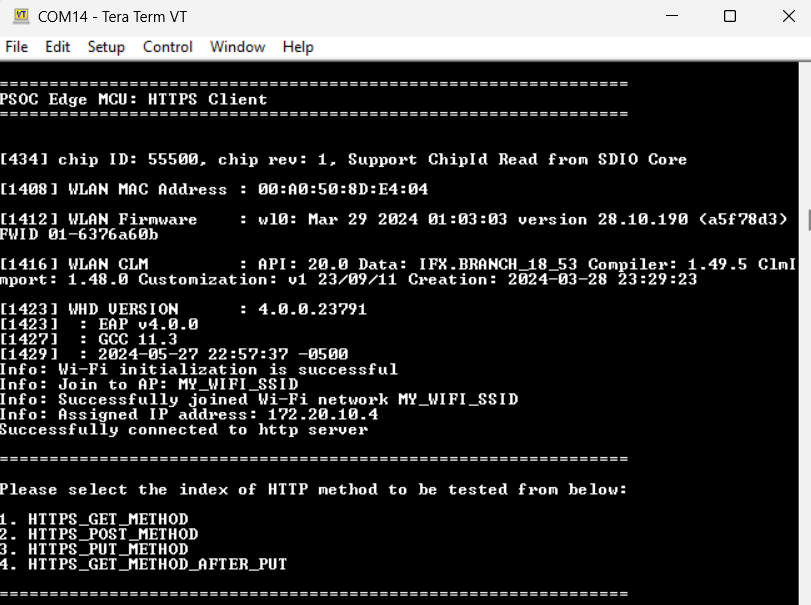
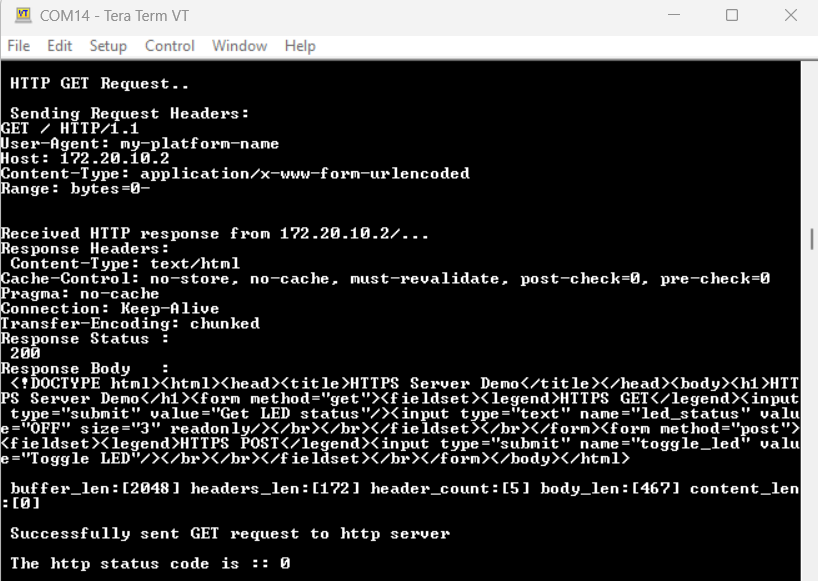
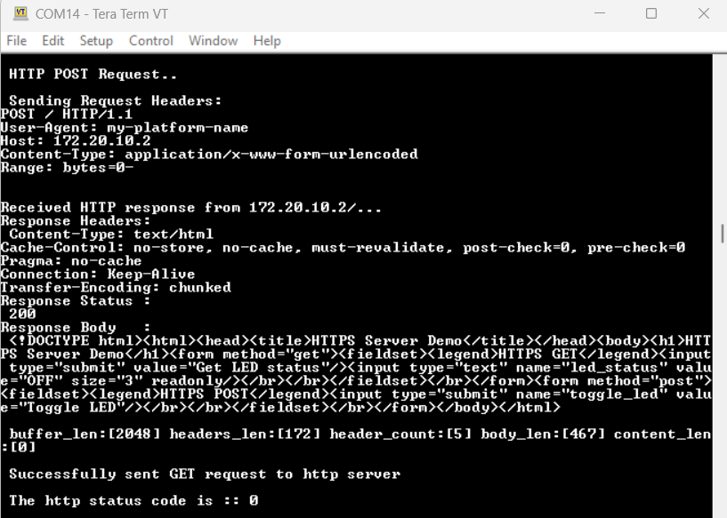
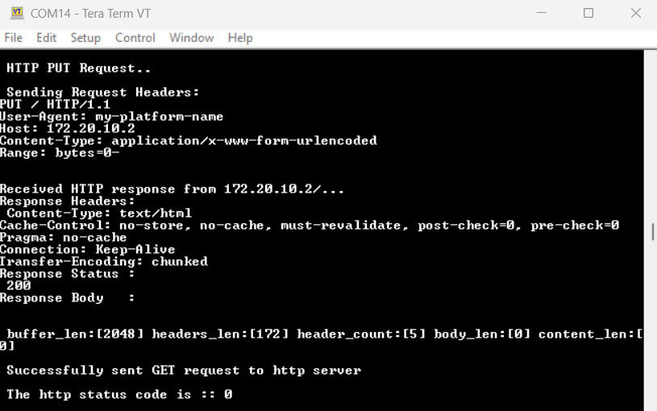
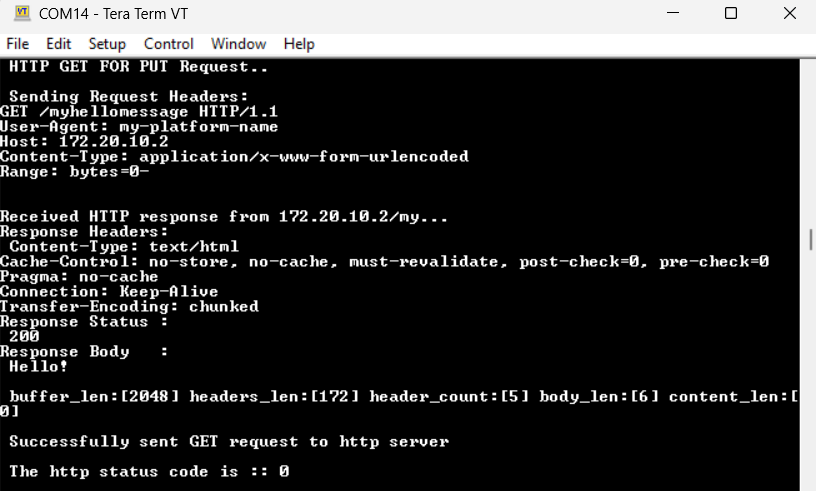

# PSOC&trade; Edge MCU: HTTPS Client

This code example demonstrates the implementation of a Hypertext Transfer Protocol Secure (HTTPS) Client using PSOC&trade; Edge MCU with AIROC&trade; CYW55513 Wi-Fi & Bluetooth&reg; combo chip.

It uses the HTTPS Client middleware library, which takes care of all the underlying socket connections with the HTTPS Server. In this example, the HTTPS Client establishes a secure connection with an HTTPS Server through a Secure Sockets Layer (SSL) handshake. After the SSL handshake completes successfully, the HTTPS Client can make GET, POST, and PUT requests with the server.

This code example has a three project structure: CM33 secure, CM33 non-secure, and CM55 projects. All three projects are programmed to the external QSPI flash and executed in Execute in Place (XIP) mode. Extended boot launches the CM33 secure project from a fixed location in the external flash, which then configures the protection settings and launches the CM33 non-secure application. Additionally, CM33 non-secure application enables CM55 CPU and launches the CM55 application.

[View this README on GitHub.](https://github.com/Infineon/mtb-example-psoc-edge-wifi-https-client)

[Provide feedback on this code example.](https://cypress.co1.qualtrics.com/jfe/form/SV_1NTns53sK2yiljn?Q_EED=eyJVbmlxdWUgRG9jIElkIjoiQ0UyNDAyNTMiLCJTcGVjIE51bWJlciI6IjAwMi00MDI1MyIsIkRvYyBUaXRsZSI6IlBTT0MmdHJhZGU7IEVkZ2UgTUNVOiBIVFRQUyBDbGllbnQiLCJyaWQiOiJzdXJlc2hrdW1hcmEiLCJEb2MgdmVyc2lvbiI6IjIuMC4wIiwiRG9jIExhbmd1YWdlIjoiRW5nbGlzaCIsIkRvYyBEaXZpc2lvbiI6Ik1DRCIsIkRvYyBCVSI6IklDVyIsIkRvYyBGYW1pbHkiOiJQU09DIn0=)

See the [Design and implementation](docs/design_and_implementation.md) for the functional description of this code example.


## Requirements

- [ModusToolbox&trade;](https://www.infineon.com/modustoolbox) v3.6 or later (tested with v3.6)
- Board support package (BSP) minimum required version: 1.0.0
- Programming language: C
- Associated parts: All [PSOC&trade; Edge MCU](https://www.infineon.com/products/microcontroller/32-bit-psoc-arm-cortex/32-bit-psoc-edge-arm) parts


## Supported toolchains (make variable 'TOOLCHAIN')

- GNU Arm&reg; Embedded Compiler v14.2.1 (`GCC_ARM`) – Default value of `TOOLCHAIN`
- Arm&reg; Compiler v6.22 (`ARM`)
- IAR C/C++ Compiler v9.50.2 (`IAR`)
- LLVM Embedded Toolchain for Arm&reg; v19.1.5 (`LLVM_ARM`)


## Supported kits (make variable 'TARGET')

- [PSOC&trade; Edge E84 Evaluation Kit](https://www.infineon.com/KIT_PSE84_EVAL) (`KIT_PSE84_EVAL_EPC2`) – Default value of `TARGET`
- [PSOC&trade; Edge E84 Evaluation Kit](https://www.infineon.com/KIT_PSE84_EVAL) (`KIT_PSE84_EVAL_EPC4`)


## Hardware setup

This example uses the board's default configuration. See the kit user guide to ensure that the board is configured correctly.

Ensure the following jumper and pin configuration on board.
- BOOT SW must be in the HIGH/ON position
- J20 and J21 must be in the tristate/not connected (NC) position


## Software setup

See the [ModusToolbox&trade; tools package installation guide](https://www.infineon.com/ModusToolboxInstallguide) for information about installing and configuring the tools package.

Install a terminal emulator if you do not have one. Instructions in this document use [Tera Term](https://teratermproject.github.io/index-en.html).

This example requires no additional software or tools.


## Operation

See [Using the code example](docs/using_the_code_example.md) for instructions on creating a project, opening it in various supported IDEs, and performing tasks, such as building, programming, and debugging the application within the respective IDEs.

The (HTTPS Client) code example needs a server to communicate. To test this code example, build and program another device with [HTTPS Server](https://github.com/Infineon/mtb-example-psoc-edge-wifi-https-server) code example to act as an HTTPS Server.

> **Note:** When two PSOC&trade; Edge E84 Evaluation Kits are used, ensure to change the MAC address of either one of the devices, which can be implemented by changing the `NVRAM_GENERATED_MAC_ADDRESS` macro in the *mtb-shared* > *wifi-host-driver* > *release-version* > *generated_mac_address.txt*. You can change the last digit of the MAC address to a different number. If this is not changed, the same MAC address and IP address will be assigned to both the kits and this will result in HTTP connection failure.

1. Connect the board to your PC using the provided USB cable through the KitProg3 USB connector

2. Open the *proj_cm33_ns* > *source* > *secure_http_client.h* file and modify the `WIFI_SSID`, `WIFI_PASSWORD`, and `WIFI_SECURITY_TYPE` macros to match the credentials of the Wi-Fi network that you want to connect with

   All possible security types are defined in the `cy_wcm_security_t` structure in the *cy_wcm.h* file

3. The code example uses a self-signed SSL certificate. Generate the certificates required by the HTTPS Server and Client so that they can successfully establish a secure HTTPS connection. Follow the steps provided in [Creating a self-signed SSL certificate](#creating-a-self-signed-ssl-certificate) section that explains how to generate the certificates

    > **Note**: Skip this step if certificates have been generated already while running the [HTTPS Server](https://github.com/Infineon/mtb-example-psoc-edge-wifi-https-server) code example

4. Open the *proj_cm33_ns* > *source* > *secure_keys.h* file and do the following:

   1. Modify `keyCLIENT_CERTIFICATE_PEM` with the contents from the *mysecurehttpclient.crt* file generated in **Step 3**
   2. Modify `keyCLIENT_PRIVATE_KEY_PEM` with the contents from the *mysecurehttpclient.key* file generated in **Step 3**
   3. Modify `keySERVER_ROOTCA_PEM` with the contents from the *rootCA.crt* file generated in **Step 3**

5. Open the *proj_cm33_ns* > *source* > *secure_http_client.h* and modify the `#define HTTPS_SERVER_HOST` macro to match the Server IP address that you want to connect with. Ensure that your server is connected to the same Wi-Fi Access Point (AP) that you have configured in **Step 2**

6. Open a terminal program and select the KitProg3 COM port. Set the serial port parameters to 8N1 and 115200 baud

7. After programming, the application starts automatically. Verify that the following logs appear on the serial terminal:

   **Figure 1. Terminal output**

   

8. Choose an HTTP method from the provided list by entering the corresponding number (between 1 and 4) and then press the **Enter** key to confirm your selection

9. If the selected method is `HTTPS_GET_METHOD`, then verify that the HTTPS Server responds with the following HTML output that contains the LED status (ON or OFF) of the kit:

   **Figure 2. HTTPS_GET_METHOD output**

   


10. If the selected method is `HTTPS_POST_METHOD`, then verify that the HTTPS Server responds with the following HTML output that response contains the LED status (ON or OFF) of the last GET request:

    **Figure 3. HTTPS_POST_METHOD output**

    

11. If the selected method is `HTTPS_PUT_METHOD` to register a new HTTP resource ("/myhellomessage=Hello!"). The HTTPS Server creates a new resource called "myhellomessage". The new resource creates logs and you can find in server logs
   
    **Figure 4. HTTPS_PUT_METHOD output**

    

12. After that, verify the newly created resource by sending an HTTPS GET request and the HTTPS Server responds with a 'Hello' text message in the response body
  
    **Figure 5. HTTPS_GET_FOR_PUT_METHOD output**

     


## Creating a self-signed SSL certificate

The HTTPS Client demonstrated in this example uses a self-signed SSL certificate. This requires **OpenSSL**, which is already preloaded in the ModusToolbox&trade; installation. A self-signed SSL certificate indicates that there is no third-party certificate issuing authority, commonly referred to as "Certificate Authority (CA)", involved in the authentication of the server. Clients connecting to the server must have a root CA certificate to verify and trust the websites defined by the certificate. Only when the client trusts the website, it establish a secure connection with the HTTPS Server.

Do the following to generate a self-signed SSL certificate.

### Generate an SSL certificate and private key

Modify the `OPENSSL_SUBJECT_INFO` macro in the *script* > *generate_ssl_certs.sh* file to match your local domain configuration, such as *Country*, *State*, *Locality*, *Organization*, *Organization Unit name*, and *Common Name*. This macro is used by the *openssl* commands when generating the certificate.

Open the modus-shell application (*{ModusToolbox&trade; install directory}/tools_\<version>/modus-shell/Cygwin.bat*) and navigate to the **script directory** of the HTTPS Server application. Run the following command to generate the self-signed SSL certificate and private key.

```
./generate_ssl_certs.sh
```

This creates the following files:

File                           | Description
-------------------------------|------------
*mysecurehttpclient.crt* | HTTPS Client certificate
*mysecurehttpclient.key* | HTTPS Client key
*mysecurehttpclient.pfx* | Bundles the HTTPS client certificate and key in PKCS12 format
*rootCA.crt* | HTTPS Server rootCA certificate to trust the client
*rootCA.key* | HTTPS Server root key used for signing the certificate
*mysecurehttpserver.local.crt* | HTTPS Server certificate
*mysecurehttpserver.local.key* | HTTPS Server private key

<br>

Configure the HTTPS client to take *mysecurehttpclient.crt* as the certificate, *mysecurehttpclient.key* as the private key, and *rootCA.crt* as the rootCA certificate.

You can either convert the values to strings manually by following the format shown in *proj_cm33_ns/source/secure_keys.h* or use the *format_cert_key.py* python file inside *script folder* to convert the certificates and keys to strings by running the below command.

```
python format_cert_key.py <certificate/key name with extension>
```


## Related resources

Resources  | Links
-----------|----------------------------------
Application notes  | [AN235935](https://www.infineon.com/AN235935) – Getting started with PSOC&trade; Edge E8 MCU on ModusToolbox&trade; software <br> [AN236697](https://www.infineon.com/AN236697) – Getting started with PSOC&trade; MCU and AIROC&trade; Connectivity devices 
Code examples  | [Using ModusToolbox&trade;](https://github.com/Infineon/Code-Examples-for-ModusToolbox-Software) on GitHub
Device documentation | [PSOC&trade; Edge MCU datasheets](https://www.infineon.com/products/microcontroller/32-bit-psoc-arm-cortex/32-bit-psoc-edge-arm#documents) <br> [PSOC&trade; Edge MCU reference manuals](https://www.infineon.com/products/microcontroller/32-bit-psoc-arm-cortex/32-bit-psoc-edge-arm#documents)
Development kits | Select your kits from the [Evaluation board finder](https://www.infineon.com/cms/en/design-support/finder-selection-tools/product-finder/evaluation-board)
Libraries  |[mtb-dsl-pse8xxgp](https://github.com/Infineon/mtb-dsl-pse8xxgp) – Device support library for PSE8XXGP <br> [retarget-io](https://github.com/Infineon/retarget-io) – Utility library to retarget STDIO messages to a UART port <br> [wifi-core-freertos-lwip-mbedtls](https://github.com/Infineon/wifi-core-freertos-lwip-mbedtls) -This repo includes core components needed for Wi-Fi connectivity support. The library bundles FreeRTOS, lwIP TCP/IP stack, Mbed TLS for security, Wi-Fi host driver (WHD), Wi-Fi Connection Manager (WCM), secure sockets, connectivity utilities, and configuration files
Tools  | [ModusToolbox&trade;](https://www.infineon.com/modustoolbox) – ModusToolbox&trade; software is a collection of easy-to-use libraries and tools enabling rapid development with Infineon MCUs for applications ranging from wireless and cloud-connected systems, edge AI/ML, embedded sense and control, to wired USB connectivity using PSOC&trade; Industrial/IoT MCUs, AIROC&trade; Wi-Fi and Bluetooth&reg; connectivity devices, XMC&trade; Industrial MCUs, and EZ-USB&trade;/EZ-PD&trade; wired connectivity controllers. ModusToolbox&trade; incorporates a comprehensive set of BSPs, HAL, libraries, configuration tools, and provides support for industry-standard IDEs to fast-track your embedded application development

<br>


## Other resources

Infineon provides a wealth of data at [www.infineon.com](https://www.infineon.com) to help you select the right device, and quickly and effectively integrate it into your design.


## Document history

Document title: *CE240253* – *PSOC&trade; Edge MCU: HTTPS Client*

 Version | Description of change
 ------- | ---------------------
 1.x.0   | New code example <br> Early access release
 2.0.0   | GitHub release
<br>


All referenced product or service names and trademarks are the property of their respective owners.

The Bluetooth&reg; word mark and logos are registered trademarks owned by Bluetooth SIG, Inc., and any use of such marks by Infineon is under license.

PSOC&trade;, formerly known as PSoC&trade;, is a trademark of Infineon Technologies. Any references to PSoC&trade; in this document or others shall be deemed to refer to PSOC&trade;.

---------------------------------------------------------

© Cypress Semiconductor Corporation, 2023-2025. This document is the property of Cypress Semiconductor Corporation, an Infineon Technologies company, and its affiliates ("Cypress").  This document, including any software or firmware included or referenced in this document ("Software"), is owned by Cypress under the intellectual property laws and treaties of the United States and other countries worldwide.  Cypress reserves all rights under such laws and treaties and does not, except as specifically stated in this paragraph, grant any license under its patents, copyrights, trademarks, or other intellectual property rights.  If the Software is not accompanied by a license agreement and you do not otherwise have a written agreement with Cypress governing the use of the Software, then Cypress hereby grants you a personal, non-exclusive, nontransferable license (without the right to sublicense) (1) under its copyright rights in the Software (a) for Software provided in source code form, to modify and reproduce the Software solely for use with Cypress hardware products, only internally within your organization, and (b) to distribute the Software in binary code form externally to end users (either directly or indirectly through resellers and distributors), solely for use on Cypress hardware product units, and (2) under those claims of Cypress's patents that are infringed by the Software (as provided by Cypress, unmodified) to make, use, distribute, and import the Software solely for use with Cypress hardware products.  Any other use, reproduction, modification, translation, or compilation of the Software is prohibited.
<br>
TO THE EXTENT PERMITTED BY APPLICABLE LAW, CYPRESS MAKES NO WARRANTY OF ANY KIND, EXPRESS OR IMPLIED, WITH REGARD TO THIS DOCUMENT OR ANY SOFTWARE OR ACCOMPANYING HARDWARE, INCLUDING, BUT NOT LIMITED TO, THE IMPLIED WARRANTIES OF MERCHANTABILITY AND FITNESS FOR A PARTICULAR PURPOSE.  No computing device can be absolutely secure.  Therefore, despite security measures implemented in Cypress hardware or software products, Cypress shall have no liability arising out of any security breach, such as unauthorized access to or use of a Cypress product. CYPRESS DOES NOT REPRESENT, WARRANT, OR GUARANTEE THAT CYPRESS PRODUCTS, OR SYSTEMS CREATED USING CYPRESS PRODUCTS, WILL BE FREE FROM CORRUPTION, ATTACK, VIRUSES, INTERFERENCE, HACKING, DATA LOSS OR THEFT, OR OTHER SECURITY INTRUSION (collectively, "Security Breach").  Cypress disclaims any liability relating to any Security Breach, and you shall and hereby do release Cypress from any claim, damage, or other liability arising from any Security Breach.  In addition, the products described in these materials may contain design defects or errors known as errata which may cause the product to deviate from published specifications. To the extent permitted by applicable law, Cypress reserves the right to make changes to this document without further notice. Cypress does not assume any liability arising out of the application or use of any product or circuit described in this document. Any information provided in this document, including any sample design information or programming code, is provided only for reference purposes.  It is the responsibility of the user of this document to properly design, program, and test the functionality and safety of any application made of this information and any resulting product.  "High-Risk Device" means any device or system whose failure could cause personal injury, death, or property damage.  Examples of High-Risk Devices are weapons, nuclear installations, surgical implants, and other medical devices.  "Critical Component" means any component of a High-Risk Device whose failure to perform can be reasonably expected to cause, directly or indirectly, the failure of the High-Risk Device, or to affect its safety or effectiveness.  Cypress is not liable, in whole or in part, and you shall and hereby do release Cypress from any claim, damage, or other liability arising from any use of a Cypress product as a Critical Component in a High-Risk Device. You shall indemnify and hold Cypress, including its affiliates, and its directors, officers, employees, agents, distributors, and assigns harmless from and against all claims, costs, damages, and expenses, arising out of any claim, including claims for product liability, personal injury or death, or property damage arising from any use of a Cypress product as a Critical Component in a High-Risk Device. Cypress products are not intended or authorized for use as a Critical Component in any High-Risk Device except to the limited extent that (i) Cypress's published data sheet for the product explicitly states Cypress has qualified the product for use in a specific High-Risk Device, or (ii) Cypress has given you advance written authorization to use the product as a Critical Component in the specific High-Risk Device and you have signed a separate indemnification agreement.
<br>
Cypress, the Cypress logo, and combinations thereof, ModusToolbox, PSoC, CAPSENSE, EZ-USB, F-RAM, and TRAVEO are trademarks or registered trademarks of Cypress or a subsidiary of Cypress in the United States or in other countries. For a more complete list of Cypress trademarks, visit www.infineon.com. Other names and brands may be claimed as property of their respective owners.